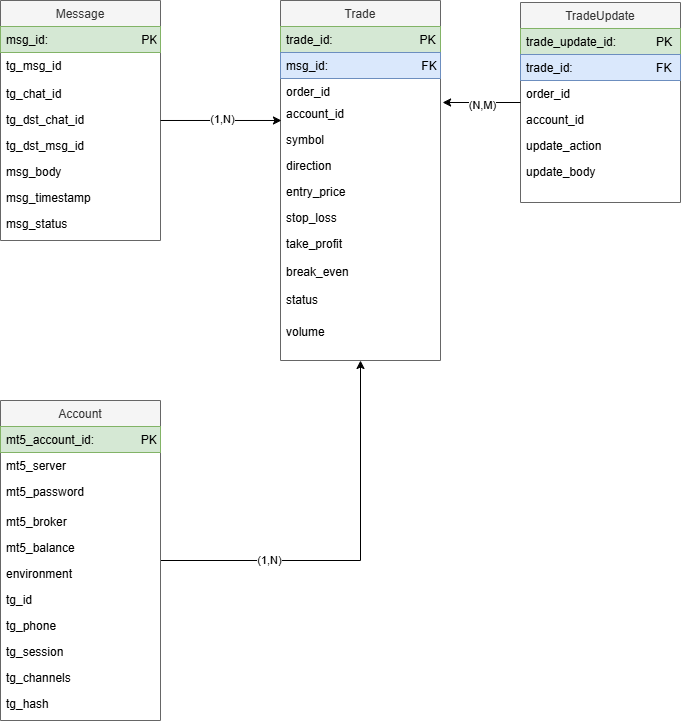

# MT5-SLT Project Documentation
## Overview

## Project Structure
### Project requirements
#### Requirements.txt
This file lists the dependencies required for the project. The dependencies are:

- telethon: A Python library to interact with Telegram's API.
- Metatrader5: A Python library to connect to the MetaTrader 5 trading platform.
- psycopg2: A PostgreSQL database adapter for Python.

### Database model and handler

#### Data/account.py
Defines the Account class, which represents an account with attributes related to MetaTrader 5 and Telegram. It includes methods to initialize the account and convert it to a dictionary.

#### Data/tables.sql
Contains SQL statements to create the necessary tables in the PostgreSQL database:
- tg_message: Stores Telegram messages.
- trade: Stores trade information.
- tradeUpdate: Stores updates to trades.
- account: Stores account information.

#### Data/tg_message.py
Defines the Message class, which represents a Telegram message with attributes such as message ID, chat ID, body, timestamp, and status. It includes methods to initialize the message and convert it to a dictionary.

#### Data/trade.py
Defines the Trade class, which represents a trade with attributes such as message ID, order ID, account ID, symbol, direction, volume, stop loss, take profit, entry price, break even, and status. It includes methods to initialize the trade and convert it to a dictionary.

#### Data/tradeUpdate.py
Defines the TradeUpdate class, which represents an update to a trade with attributes such as trade ID, order ID, account ID, update action, and update body. It includes methods to initialize the trade update and convert it to a dictionary.

#### Data/dbHandler.py
Defines the dbHandler class, which handles database operations such as connecting to the database, creating tables, and performing CRUD operations for messages, trades, trade updates, and accounts. It includes methods to:
- Connect to the PostgreSQL database.
- Create tables using SQL statements.
- Insert, retrieve, and update messages.
- Insert and retrieve trades.
- Insert trade updates.
- Retrieve accounts based on the environment.